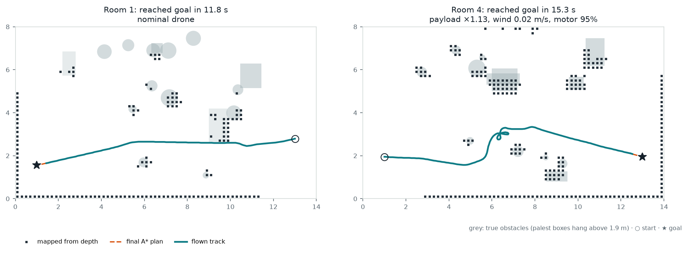
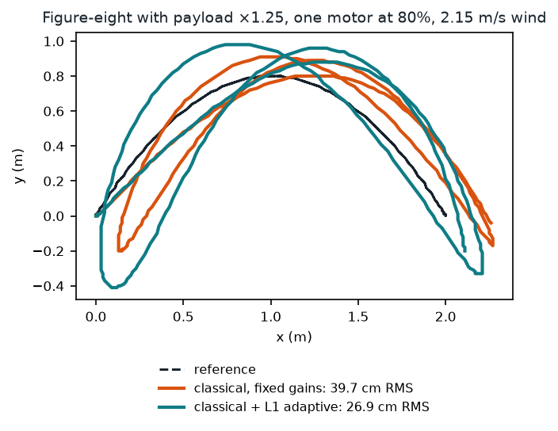
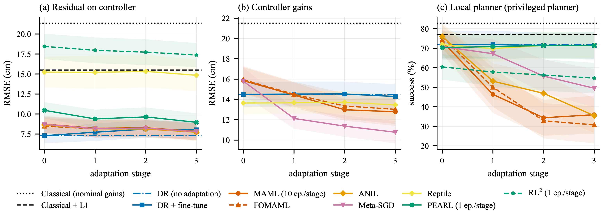

# Drone Autonomy

A quadrotor that maps unknown rooms with a depth camera, plans with A*, and adapts to payload, wind and motor wear, using seven meta-learning algorithms combined with classical control and planning. Everything runs in simulation, with a plan for real flights on a Holybro X500 V2.

**[Project page: replay the recorded flights and browse the results](https://amalmehta.github.io/DroneAutonomy/)** · **[Paper (PDF)](paper/Where%20Does%20Meta-Learning%20Help%20a%20Quadrotor.pdf)**

| | |
|---|---|
| [Setup, run and use](docs/INSTRUCTIONS.md) | install, train, benchmark, record the demo |
| [System design](docs/SYSTEM-DESIGN.md) | architecture, components, flows, decisions, limits |
| [File structure](docs/FILE-STRUCTURE.md) | what's where |
| [Drone selection](docs/DRONE-SELECTION.md) | which drone to fly the stack on, and the test plan |
| [Paper (PDF)](paper/Where%20Does%20Meta-Learning%20Help%20a%20Quadrotor.pdf) | IEEE conference-format write-up of the study |

Findings, in simulation: a learned residual roughly halves the error of tuned L1 adaptation; meta-learning pays off when it adapts the classical controller's gains (Meta-SGD, 3.5 cm better than non-meta tuning on paired tasks); gradient adaptation at meta-trained step sizes degrades learned navigation planners, and the classical planner is the most reliable on the full stack (73% success over 96 unseen-room flights); every method fails out of distribution.
