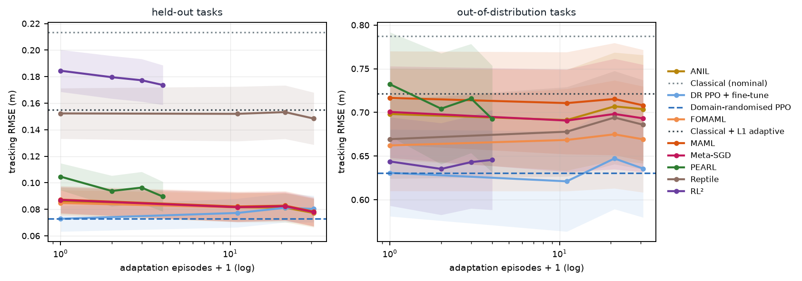

# Drone Autonomy

A quadrotor that maps unknown rooms with a depth camera, plans with A*, and adapts to payload, wind and motor wear, using seven meta-learning algorithms combined with classical control and planning. Everything runs in simulation, with a plan for real flights on a Holybro X500 V2.

**[Live demo: replay the recorded flights and browse the results](https://amalmehta.github.io/DroneAutonomy/)**

| | |
|---|---|
| [Setup, run and use](docs/INSTRUCTIONS.md) | install, train, benchmark, record the demo |
| [System design](docs/SYSTEM-DESIGN.md) | architecture, components, flows, decisions, limits |
| [File structure](docs/FILE-STRUCTURE.md) | what's where |
| [Drone selection](docs/DRONE-SELECTION.md) | which drone to fly the stack on, and the test plan |

Status: simulator, navigation stack, seven meta-learning algorithms and baselines are built, trained and benchmarked (numbers in `results/summary.json` and on the website). The paper is next.
