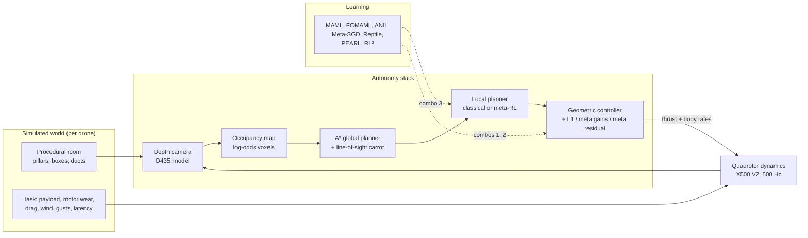

# System Design

Drone Autonomy is a simulation suite for one question: can meta-learning, combined with classical control and planning, let a quadrotor adapt quickly to the physical conditions it actually meets (payload, worn motors, drag, wind, latency), and does that hold up outside the training range? It also picks the real drone to test on (see [DRONE-SELECTION.md](DRONE-SELECTION.md)).

## Architecture

## Components

| Component | File | Job |
|---|---|---|
| Platform config | `config.py` | X500 V2 + Jetson + D435i parameters (mass, arm and inertia from PX4's x500 model; thrust-to-weight, motor lag and drag estimated), timing, nominal gains |
| Task distribution | `tasks.py` | Samples the conditions to adapt to. Train/test share ranges with disjoint seeds; OOD lies beyond them |
| Dynamics | `dynamics.py` | Batched rigid body in Numba. Latency buffer → PX4-like body-rate PI loop → X mixer with yaw-first desaturation → first-order motors × per-motor efficiency → forces with linear drag, steady wind and Ornstein–Uhlenbeck gusts |
| Classical control | `control.py` | Geometric controller (position PID → collective thrust + body rates) with per-drone gains; optional piecewise-constant L1 adaptive augmentation |
| World | `world.py` | Procedural 14 × 8 × 3 m rooms, collision checks against a 0.35 m drone sphere, rasterised true occupancy |
| Perception | `perception.py` | Analytic ray casting, 87° × 58° FOV, 5 m range, noise σ = 0.008·d², 2% dropouts |
| Mapping | `mapping.py` | Log-odds voxel map (0.2 m). Free space carved along each ray, stopping one voxel short of a hit; dropouts skipped |
| Planning | `planning.py` | Inflation, 26-connected A*, shortcutting, carrot selection with line-of-sight checks, Dijkstra fields |
| Environments | `envs/` | Tracking (residual or gains mode) and navigation (oracle / mapping / end-to-end planners), batched with synchronised episodes |
| Learners | `rl/` | Functional policies, batched rollouts, all meta-learning algorithms and baselines |

## Main flows

**Navigation step (10 Hz).** Render depth → (mapping mode) integrate into the map; replan A* every 0.5 s → pick the carrot, the furthest point up to 1.5 m along the path still in line of sight → local planner outputs a velocity in the yaw frame → 10 controller ticks at 100 Hz, each integrating a leashed position setpoint and running the geometric controller → 5 physics substeps per tick → collision and goal checks.

**Tracking step (50 Hz).** The geometric controller follows a smooth random reference. In residual mode, the policy adds a bounded thrust and body-rate correction. In gains mode, the gains are fixed for the episode.

**Gradient-based meta-training (MAML family).** Sample T tasks → roll out E episodes each with shared parameters → one policy-gradient inner step per task. All T inner steps run at once: parameters are expanded to per-task views, and one backward pass of the summed losses yields every task's gradient. Then roll out the adapted policies → PPO-clipped outer loss through the adapted parameters (second-order for MAML, ANIL and Meta-SGD; first-order for FOMAML). Reptile takes several per-task PPO steps and moves θ toward their mean.

**PEARL.** Per-task replay buffers. Each iteration flies one episode per task with z drawn from the prior, and one with z from the posterior. SAC updates train the encoder through the critic loss plus a KL penalty.

**RL².** Trials of three episodes per task with the GRU state carried across them. Recurrent PPO over whole trials, with GAE over live steps only.

**Evaluation** (`benchmark.py`). Every method is scored on the same fixed held-out (32 tasks; navigation 24) and OOD task sets, before adaptation and after each of 3 adaptation stages (gradient methods: one update from 10 exploratory episodes per stage; PEARL: one more episode of context; RL²: one more episode of the trial), and plotted against the flight data consumed. Every navigation evaluation episode is flown in its own room from a held-out pool of 128. Navigation is scored twice: with the privileged planner, and on the full depth → map → A* stack in 48 unseen rooms per seed before and after one adaptation stage, whose exploration flights use the privileged planner (a calibration flight in a known room). Results land in `results/<problem>/<method>_seed<k>.json`; `drone-autonomy figures` turns them into `results/summary.json`, `website/data/results.json` and the adaptation figures.

## Where data lives

| Data | Location |
|---|---|
| Training checkpoints, logs | `runs/<problem>/<method>/seed<k>/` (not committed) |
| Sweep / process logs | `logs/` (not committed) |
| Recorded demo flights | `website/data/demo.json` |
| Figures | `docs/images/` |
| Platform and task parameters | `config.py`, `tasks.py` |

## Key design decisions and trade-offs

- **Own simulator in NumPy + Numba instead of PyBullet or Isaac.** The machine is an Intel Mac with no CUDA. Batched, Numba-compiled physics runs hundreds of drones per process and keeps every assumption visible. The cost is less visual and contact realism.
- **CTBR command interface.** It matches PX4 offboard `VehicleRatesSetpoint`, so the learned outputs map one-to-one to the real drone. The local planner outputs velocities, and the classical controller turns those into CTBR. This keeps the learned part small and the classical safety envelope in place.
- **Synchronised episodes.** All drones reset together and run a fixed horizon, with crashed drones parked. This matches episodic meta-RL and keeps batching simple, at the cost of some wasted compute after crashes.
- **Same estimator for every gradient-based method.** Per-task linear feature baselines with GAE and PPO-clipped outer updates, so differences come from the meta-learning rule rather than the advantage estimator.
- **Privileged planner for training, online mapping for evaluation.** Training the local planner uses a Dijkstra field on the true map, so data collection stays fast. Final evaluation uses the full depth → map → A* pipeline. A policy may therefore meet planner behaviour at test time that it never saw in training.
- **Classical local planner = pure pursuit + depth repulsion + heading gating.** A deliberately standard baseline. With a perfect map, A* plus this follower reached 16 of 16 goals in testing; with the online map, 16 of 24 (67%).
- **Navigation meta-learners start from the trained DR local planner.** From scratch they reached 0% success within the CPU budget. Starting every gradient-based method from the same competent planner also isolates what meta-training adds. PEARL and RL² use different networks and still train from scratch.
- **Smaller adaptation step on navigation.** Per-task PPO adaptation uses Adam at 3e-3 on tracking but 3e-4 on navigation: at 3e-3 Reptile wrecked the warm-started planner (0% success; the run is kept in `runs/failed/`).
- **Distinct evaluation rooms.** An early version drew evaluation rooms with replacement, so rooms repeated; every evaluation episode now gets its own room (old results kept in `results/superseded/`).
- **Hanging obstacles start at 1.9 m and higher.** The stereo camera sees duct undersides only at grazing angles, and lower ducts made the mapped stack fail for reasons unrelated to the study.

## How it's tested

- `tests/test_core.py`: hover equilibrium, free fall, controller convergence, task-split ranges, exact ray-cast range against a pillar, collision checks, map hit and free updates, A* routing around a wall, tracking-env reward and metrics, and a Meta-SGD second-order step reaching the learned inner rates.
- Stack-level checks run during development (kept as diagnostics, not unit tests): the classical stack with an oracle map vs a perfect A* map vs the online map, and per-factor sensitivity of the controller to each task parameter.

## Known limits

- The physical parameters are partly estimated (thrust-to-weight, motor lag, drag); Stage 0 of the real-world plan replaces them.
- No aerodynamic effects beyond linear drag: no ground effect, rotor drag or blade flapping.
- The depth model has no stereo artefacts beyond range noise and dropouts (no texture or lighting dependence).
- State estimation is perfect in simulation. VIO drift is not modelled.
- MAML-RL ignores the dependence of the pre-update sampling distribution on θ (as in the original MAML-RL implementation).
- Compute: the experiments run on a shared, heavily loaded CPU, so seeds (2 for the residual, 5 for gains, 2 for navigation) and iteration budgets are smaller than ideal.
- The OOD ranges proved harsh enough that every method fails on them; they measure graceful degradation more than adaptation.
